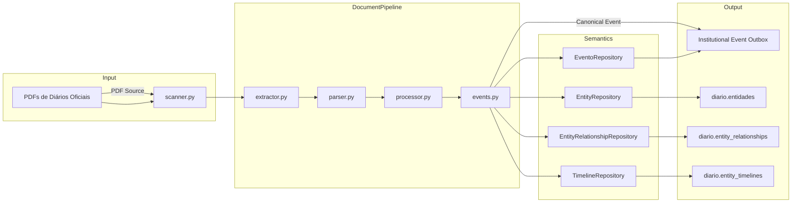
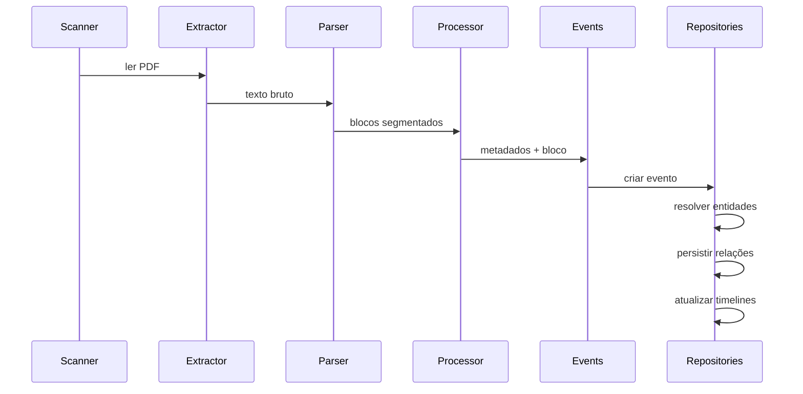
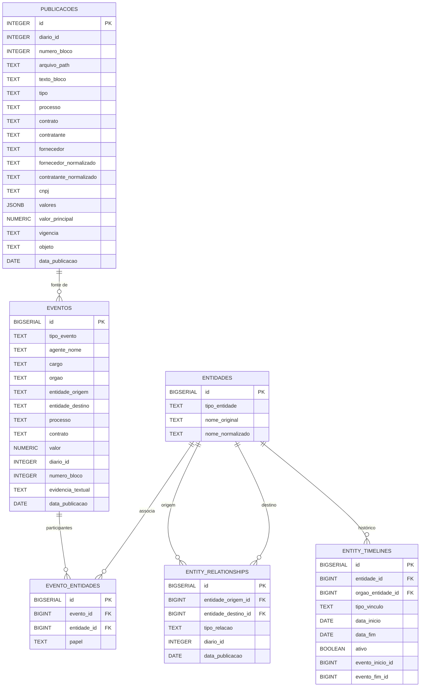
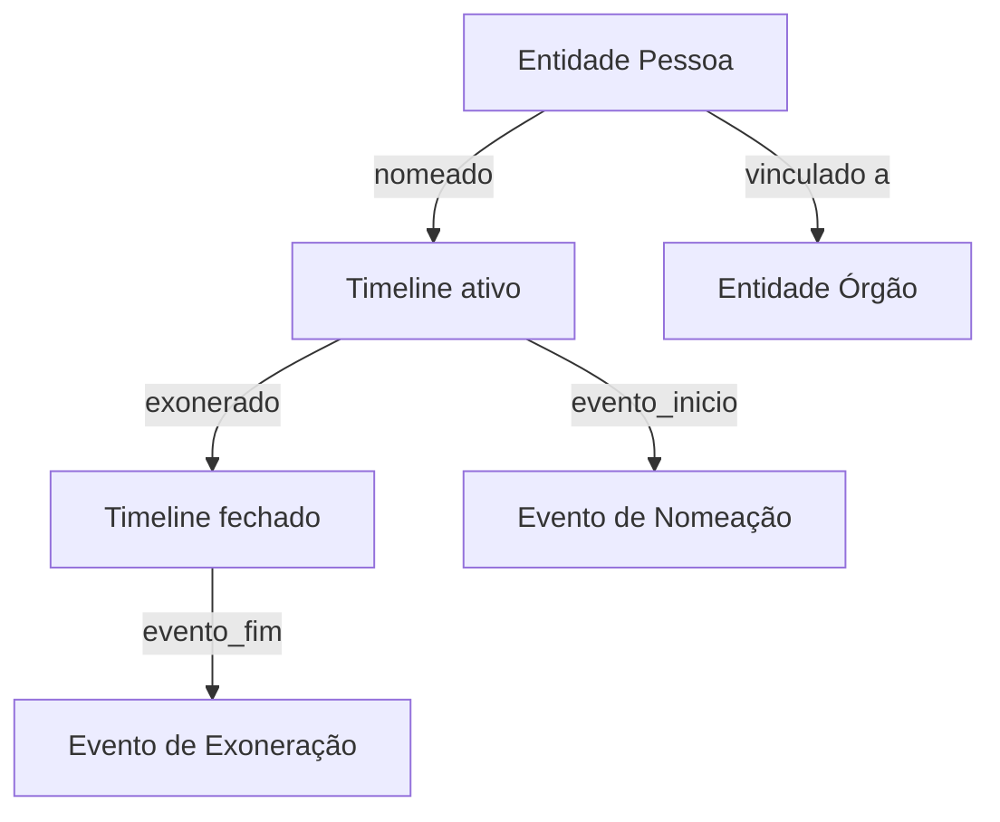
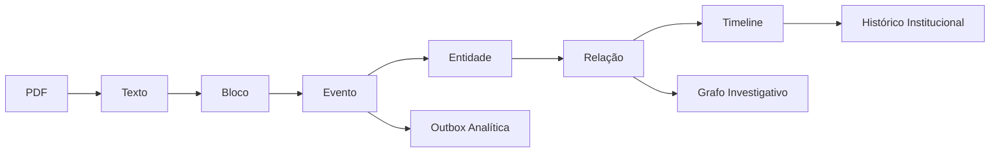

# Diário Processor — Documentação Técnica Completa

## 1. Visão Geral do Projeto

### Objetivo do sistema
O `diario_processor` transforma Diários Oficiais municipais em ativos de inteligência institucional.

Ele converte PDFs públicos em:
- eventos institucionais estruturados
- entidades normalizadas
- relações semânticas
- timelines investigativas

O foco é extrair padrões contratuais, movimentações administrativas e vínculos de servidores públicos.

### Papel dentro do ecossistema
O projeto é um motor de ingestão e normalização documental em um ecossistema maior de inteligência institucional.

Ele ocupa a fase de:
- ingestão de dados públicos
- transformação documental
- persistência semântica
- apoio a análise e investigação

### Contexto investigativo
O `diario_processor` foi desenhado para servir investigações de integridade pública, compliance e transparência.
Ele não é apenas um parser de PDF, mas uma camada que converte documentos em evidências pesquisáveis:
- quem contratou quem
- quais contratos foram publicados
- nomeações/exonerações em órgãos públicos
- ligações entre pessoas e órgãos

### Arquitetura geral
A arquitetura é modular e orientada a pipelines:
- `scanner` localiza PDFs no diretório
- `extractor` converte PDF em texto bruto
- `parser` segmenta e extrai campos contextuais
- `processor` classifica e monta metadados
- `events` identifica eventos institucionais
- repositórios persistem publicações, eventos, entidades, relações e timelines
- `InstitutionalEventOutboxRepository` entrega eventos canônicos a um barramento analítico

---

## 2. Arquitetura do Sistema

### Estrutura de pastas

- `main.py` — orquestra o pipeline de ingestão
- `scanner.py` — detecção de PDFs e extração de metadados do arquivo
- `extractor.py` — extração textual de PDF com `pdfplumber` e correção de encoding `ftfy`
- `parser.py` — segmentação de publicações e extração documental
- `processor.py` — extração de metadados contratuais e classificação
- `events.py` — identificação de eventos institucionais e evidências
- `canonical_event_builder.py` — normalização de eventos antes da publicação
- `normalizer.py` / `normalizers/entity_normalizer.py` — normalização de nomes e entidades
- `infra/db/connection.py` — conexão PostgreSQL com pool e retry
- `infra/db/repositories/` — repositórios de persistência e consulta
- `infra/db/migrations/` — migrações SQL para o modelo relacional
- `analytics.py` — consultas analíticas legadas em SQLite
- `config.py` — configuração de ambiente e variáveis

### Responsabilidades dos módulos

- `scanner.py`: localiza PDFs e extrai `diario_id` e data de publicação
- `extractor.py`: lê PDF e produz texto bruto
- `parser.py`: segmenta o texto em publicações e mapeia campos como processo, contrato, fornecedor, contratante, vigência, valores
- `processor.py`: classifica tipos, define relevância e enriquece apenas blocos contratuais prioritários
- `events.py`: identifica eventos de contratação, nomeação e exoneração
- `canonical_event_builder.py`: gera um evento canônico desacoplado para publicação em outbox
- `normalizer.py`: normaliza nomes de entidades contratuais
- `normalizers/entity_normalizer.py`: normaliza nomes de entidades públicas e pessoas para deduplicação
- `infra/db/...`: persistência e construção de modelos investigativos

### Fluxo completo de processamento

1. `main.py` chama `listar_pdfs()` em `scanner.py`
2. Para cada PDF não processado, extrai texto com `extractor.extrair_texto()`
3. Identifica `data_publicacao` pelo texto
4. Segmenta o Diário em blocos com `parser.segmentar_publicacoes()`
5. Extrai metadados contratuais com `processor.extrair_metadados_bloco()`
6. Detecta eventos institucionais em `events.extrair_eventos_bloco()`
7. Persiste evento em `EventoRepository.salvar_evento()`
8. Publica o evento canônico em `InstitutionalEventOutboxRepository.publish()`
9. Resolve/ou cria entidades em `EntityRepository.obter_ou_criar()`
10. Persiste relações em `EntityRelationshipRepository.criar_relacao()`
11. Atualiza timelines com `TimelineRepository.abrir_vinculo()` e `fechar_vinculo()`
12. Persiste a publicação raw em `PublicacaoRepository.salvar_publicacao()`

### Pipeline documental

- `scanner` detecta e identifica
- `extractor` converte PDF para texto
- `parser` segmenta e identifica blocos publicacionais
- `processor` extrai tipo, processo, contrato, CNPJ, valores, contratante, fornecedor, vigência, objeto
- persistência raw em `publicacoes`

### Pipeline semântico

- `events` converte conteúdo em eventos estruturados
- `canonical_event_builder` cria payload canônico
- repositórios de entidades e relações constroem o grafo semântico
- `InstitutionalEventOutboxRepository` integra com consumidores analíticos

### Pipeline investigativo

- timelines de vínculos são atualizadas
- relações entre entidade-pessoa e órgão são criadas
- eventos contratuais e funcionais ficam disponíveis para reconstrução temporal
- relatórios analíticos podem apoiar investigação de recorrência e movimentação

---

## 3. Fluxo de Processamento

### Scanner de PDFs

`scanner.listar_pdfs()`
- usa `BASE_DIARIO_PATH` do `config.py`
- busca recursivamente arquivos `*.pdf`
- ordena para garantir ingestão determinística

`scanner.extrair_diario_id(pdf_path)`
- extrai `diario_id` do nome do arquivo, assumindo padrão `diario_<id>.pdf`

`scanner.extrair_data_publicacao(texto)`
- procura cabeçalho de edição do Diário Oficial
- identifica dia/mês/ano do texto inicial
- retorna `datetime.date`

### Extração textual

`extractor.extrair_texto(pdf_path)`
- usa `pdfplumber.open()` para ler cada página
- aplica `fix_text()` para correção de encoding e caracteres corrompidos
- concatena páginas com separador de linha

### Segmentação

`parser.segmentar_publicacoes(texto)`
- divide o Diário em blocos/publicações
- identifica inícios por marcadores como `CONTRATO`, `EXTRATO`, `AVISO`, `PORTARIA`, `TERMO`, `PREGÃO`, `EDITAL`, `DISPENSA`, `INEXIGIBILIDADE`, `ERRATA`, `HOMOLOGAÇÃO`, `ADJUDICAÇÃO`
- ignora linhas boilerplate de rodapé/cabeçalho
- tenta não reiniciar blocos em transições de título de linha

### Parsing

`parser` também contém funções de extração contextual:
- `extrair_contrato()`
- `extrair_processo()`
- `extrair_cnpj()`
- `extrair_fornecedor()`
- `extrair_contratante()`
- `extrair_objeto()`
- `extrair_vigencia()`
- `extrair_valor_principal()`
- `extrair_valores()`

O parser usa regex orientadas a contexto e rótulos documentais para evitar falsos positivos.

### Classificação

`processor.extrair_metadados_bloco()`
- identifica tipo de publicação com `parser.identificar_tipo()`
- apenas blocos contratuais e extratos recebem enriquecimento contratual

### Extração de eventos

`events.extrair_eventos_bloco()`
- detecta eventos a partir de metadados e texto do bloco
- atualmente identifica pelo menos:
  - contratação pública (`public_contract`)
  - nomeação (`appointment`)
  - exoneração (`exoneration`)
- para eventos contratuais, a origem é o órgão público e o destino é a empresa
- para eventos funcionais, o agente é servidor/pessoa e o órgão é o destino
- captura evidências textuais com `diario_id`, `numero_bloco` e trecho do texto

### Entity resolution

`EntityRepository.obter_ou_criar()`
- normaliza nomes com `normalizers.entity_normalizer.normalize_entity_name()`
- resolve ou insere entidades únicas no schema `diario.entidades`
- evita duplicação semântica por `tipo_entidade` + `nome_normalizado`

### Criação de relações

`EventoRepository.relacionar_entidade()`
- persiste vínculos entre `evento` e `entidade`
- registra papel como:
  - `contracting_org`
  - `public_agent`
  - `supplier`

`EntityRelationshipRepository.criar_relacao()`
- persiste relações semânticas entre entidades
- campos: `entidade_origem_id`, `entidade_destino_id`, `tipo_relacao`, `diario_id`, `data_publicacao`
- usa `taxonomy.relation_resolver.resolver_relacao_evento()` para mapear eventos a relações

### Timelines

`TimelineRepository` gerencia vínculos investigativos de entidades públicas:
- `abrir_vinculo()` cria histórico ativo de lotação ou nomeação
- `fechar_vinculo()` encerra o vínculo quando ocorre exoneração
- os registros mantêm `data_inicio`, `data_fim`, `evento_inicio_id`, `evento_fim_id` e `ativo`

---

## 4. Modelo de Dados

### publicacoes

Finalidade:
- armazena cada bloco/publicação do Diário
- preserva texto bruto e metadados extraídos

Campos principais:
- `diario_id`, `numero_bloco`, `arquivo_path`
- `texto_bloco`
- `tipo`, `processo`, `contrato`
- `contratante`, `fornecedor`, `cnpj`
- `fornecedor_normalizado`, `contratante_normalizado`
- `valores` (JSONB / JSON)
- `valor_principal`, `vigencia`, `objeto`
- `data_processamento`, `data_publicacao`

Relações investigativas:
- serve como fonte de evidência documental
- alimenta extração de eventos e análises contratuais

Índices:
- `arquivo_path`
- `fornecedor_normalizado`
- `contratante_normalizado`
- `valor_principal`
- `tipo`
- `data_processamento`
- `data_publicacao`

Temporalidade:
- `data_publicacao` representa a data do Diário Oficial
- `data_processamento` representa a importação do dado

### eventos

Finalidade:
- registra eventos institucionais extraídos a partir de blocos
- abstrai ações como nomeação, exoneração e contratação

Campos principais:
- `tipo_evento`
- `agente_nome`, `cargo`, `orgao`
- `entidade_origem`, `entidade_destino`
- `processo`, `contrato`, `valor`
- `diario_id`, `numero_bloco`
- `evidencia_textual`, `data_publicacao`

Relação investigativa:
- eventos são nós centrais no grafo investigativo
- permitem reconstruir quem fez o quê e quando

Índices:
- `tipo_evento`
- `agente_nome`
- `orgao`
- `diario_id`
- `contrato`
- `processo`
- `data_publicacao`

### entidades

Finalidade:
- representa pessoas, empresas e órgãos públicos
- suporta deduplicação semântica

Campos:
- `tipo_entidade` (`person`, `company`, `public_agency`)
- `nome_original`
- `nome_normalizado`

Relações investigativas:
- entidades são vértices do grafo
- permitem cruzar eventos, contratos e relações

Índices:
- `tipo_entidade`
- `nome_normalizado`
- `UNIQUE(tipo_entidade, nome_normalizado)`

### evento_entidades

Finalidade:
- mapeia quais entidades participam de cada evento
- registra o papel da entidade no evento

Campos:
- `evento_id`
- `entidade_id`
- `papel`

Relações investigativas:
- conecta eventos a entidades
- permite recuperar contextos como fornecedor, órgão e agente

Índices:
- `evento_id`
- `entidade_id`
- `papel`

### entity_relationships

Finalidade:
- captura relações semânticas persistentes entre entidades
- fornece material para grafo investigativo e consultas de relacionamento

Campos:
- `entidade_origem_id`
- `entidade_destino_id`
- `tipo_relacao`
- `diario_id`
- `data_publicacao`

Relações investigativas:
- representa conjunto de pares semânticos, como pessoa → órgão
- utiliza tipos de relacionamento normalizados

Índices:
- `entidade_origem_id`
- `entidade_destino_id`
- `tipo_relacao`
- `data_publicacao`

### entity_timelines

Finalidade:
- modela a história temporal de vínculos institucionais
- fundamenta investigações de permanência e transição

Campos:
- `entidade_id`
- `orgao_entidade_id`
- `tipo_vinculo`
- `data_inicio`, `data_fim`
- `ativo`
- `evento_inicio_id`, `evento_fim_id`

Relações investigativas:
- representa trajetórias funcionais de pessoas em órgãos
- permite identificar vínculos ativos e encerrados

Índices:
- `entidade_id`
- `orgao_entidade_id`
- `ativo`
- `(data_inicio, data_fim)`

---

## 5. Camadas de Inteligência

### Document Intelligence

- preserva texto bruto de cada bloco
- usa segmentação de publicações baseada em marcadores documentais
- extrai metadados confiáveis com rótulos contextuais
- minimiza falsos positivos via heurísticas semânticas

### Event Intelligence

- transforma conteúdo documental em eventos estruturados
- abstrai ações institucionais replicáveis
- produz payloads canônicos para downstream
- permite classificação de tipo e relevância

### Identity Intelligence

- normaliza entidades por tipo e nome
- resolve variações de escrita, sufixos e ruído documental
- garante unicidade semântica em `diario.entidades`
- suporta deduplicação investigativa

### Relationship Intelligence

- converte eventos em relações entre entidades
- utiliza um taxonomia de tipos de relação
- preserva origem documental do relacionamento
- cria um grafo semântico consultável

### Timeline Intelligence

- materializa a sequência temporal de vínculos
- abre e fecha vínculos com eventos de nomeação/exoneração
- identifica vínculos ativos
- permite reconstrução histórica de trajetórias

---

## 6. Taxonomia Investigativa

### Tipos de eventos

A taxonomia implementada em `taxonomy/event_taxonomy.py` inclui:
- `appointment` — nomeação
- `exoneration` — exoneração
- `public_contract` — contratação pública
- `contract_amendment` — aditivo/alteração contratual
- `bidding` — licitação
- `bidding_waiver` — dispensa/inexigibilidade
- `designation` — designação

Além disso, há compatibilidade com rótulos legados:
- `nomeacao`, `exoneracao`, `aditivo`, `dispensa`, `licitacao`, etc.

### Tipos de relações

Relações mapeadas:
- `appointed`
- `dismissed`
- `contracted`
- `authorized`
- `designated_to`
- `participated_in_contract`
- `related_to` (fallback)

### Semântica institucional

O sistema distingue:
- entidade origem: órgão público ou contratante
- entidade destino: fornecedor, empresa ou órgão receptor
- agente público: pessoa nomeada ou exonerada

A semântica institucional é estabelecida no `resolver_relacao_evento()`.

### Taxonomia atual

A taxonomia atual é leve, baseada em eventos documentais e em mapeamento de relação:
- eventos nomeação → relacionamento `appointed`
- eventos exoneração → relacionamento `dismissed`
- eventos contratuais → relacionamento `contracted`
- licitação / dispensa → relações `participated_in_contract` ou `authorized`

---

## 7. Entity Resolution

### Normalização

A normalização de entidades é feita em `normalizers/entity_normalizer.py`:
- remove acentos
- converte para uppercase
- expande abreviações administrativas (`SEC` → `SECRETARIA`)
- remove prefixos de ruído (`SR`, `DR`, `O SERVIDOR`, etc.)
- remove pontuação e espaços extras
- elimina termos irrelevantes como `DE`, `DO`, `DA`

### Canonicalização

- `EntityRepository.obter_ou_criar()` usa `tipo_entidade` + `nome_normalizado`
- evita multiplicidade de registros para a mesma pessoa ou órgão

### Limpeza semântica

- parser identifica e ignora candidatos de fornecedor que parecem orgãos ou boilerplate
- normalização de fornecedor/contratante diferencia `Fornecedor` de `Contrato`

### Deduplicação

- `diario.entidades` possui índice único semântico em `(tipo_entidade, nome_normalizado)`
- entidades conflitantes são resolvidas por norma de nome canônico
- o grafo de relações reconcilia múltiplos eventos para a mesma entidade canônica

---

## 8. Timeline Intelligence

### Abertura de vínculo

`TimelineRepository.abrir_vinculo()` é chamado quando um evento de nomeação gera um relacionamento `appointed`.

O vínculo gerado contém:
- `entidade_id` (pessoa)
- `orgao_entidade_id` (órgão/destino)
- `tipo_vinculo` = `LOTACAO`
- `data_inicio` = `data_publicacao`
- `evento_inicio_id`
- `ativo` = TRUE

### Encerramento

`TimelineRepository.fechar_vinculo()` fecha vínculos ativos quando um evento `dismissed` é registrado.

Ele atualiza:
- `data_fim`
- `evento_fim_id`
- `ativo` = FALSE

### Vínculos ativos

A tabela `entity_timelines` permite consultas de vínculos ativos e históricos.

Vínculos ativos são aqueles com `ativo = TRUE` e sem `data_fim` definido.

### Histórico institucional

A timeline fornece a estrutura para reconstruir trajetórias funcionais de agentes públicos em órgãos.

Ela é essencial para:
- entender permanência de servidores
- detectar rotatividade em órgãos
- conectar nomeações e exonerações cronologicamente

---

## 9. Explainability

### Evidência documental

Cada evento carrega um campo `evidencia_textual` com trecho do bloco.
A publicação original (`diario_id`, `numero_bloco`, `texto`) é preservada.

### Rastreabilidade

A cadeia de rastreabilidade inclui:
- arquivo PDF fonte
- bloco segmentado
- metadados extraídos
- evento institucional
- entidades canônicas
- relações semânticas
- timelines abertas/fechadas

### Origem da inferência

A inferência é sempre ancorada em rótulos documentais e regex contextuais.

Exemplos:
- rótulo `CONTRATANTE:` para origem contratual
- `NOMEAR`/`EXONERAR` para eventos funcionais
- `VIGÊNCIA:` para prazo de vínculo

### Vínculo com Diário Oficial

O registro de `diario_id` e `numero_bloco` em eventos e relações permite vincular cada inferência à publicação original do Diário.

Isso garante que qualquer conclusão investigativa possa ser auditada até o documento público fonte.

---

## 10. Fluxos Investigativos Possíveis

### Movimentação administrativa

- identificar nomeações e exonerações em órgãos públicos
- rastrear entrada e saída de servidores
- avaliar ritmo de mudança de gestão

### Troca de gestão

- comparar eventos `appointed` e `dismissed` por órgão
- detectar transições concentradas em datas próximas
- inferir mudança de equipe ou reestruturação

### Recorrência institucional

- usar `entity_relationships` para identificar contratações repetidas entre o mesmo órgão e fornecedor
- mapear recorrência de despesas e contratos
- priorizar fornecedores com múltiplos contratos em curtos períodos

### Trajetórias funcionais

- usar `entity_timelines` para reconstruir carreira de uma pessoa dentro do setor público
- identificar períodos de lote e interrupções
- cruzar nomeações com órgãos e cargos

### Reconstrução temporal

- usar `data_publicacao` de `publicacoes`, `eventos` e `entity_relationships`
- gerar linhas de tempo de contratos e vínculos
- auditar a sequência de eventos de um agente ou empresa

---

## 11. Integração com o Ecossistema

### diário_bot

O `diario_processor` consome PDFs produzidos por um coletor de Diário Oficial, que geralmente é um componente como `diario_bot`.

Papel esperado:
- `diario_bot` coleta e armazena PDFs
- `diario_processor` lê `BASE_DIARIO_PATH` e processa esses arquivos

### transparencia_collector

O projeto se integra conceitualmente com coletores de transparência externos:
- enriquecimento de entidades públicas
- validação de CNPJ e contratos
- cruzamento de fornecedores com bases oficiais

### analytics_engine

O `analytics_engine` consome eventos canônicos e dados relacionais para análise avançada.

Pontos de integração reais:
- `InstitutionalEventOutboxRepository.publish()` insere eventos em `analytics.institutional_events_outbox`
- consumidores downstream podem indexar esses eventos para dashboards e alertas

---

## 12. Roadmap Futuro

### Deduplicação relacional

- implementar normalização de relações além de entidades
- consolidar múltiplas relações idênticas entre o mesmo par de entidades
- evitar ruído no grafo semântico

### Investigative scoring

- criar scores de risco e relevância para eventos, entidades e relações
- priorizar investigações por padrão de recorrência e valor
- calcular alertas de anomalia com base em histórico

### Explainability avançada

- capturar fontes de inferência com granularidade mais fina
- gerar justificativas automáticas para cada relação e timeline
- adicionar amarras de confiança para extrações heurísticas

### APIs investigativas

- expor endpoints para consulta de grafo, timelines e eventos
- permitir queries como `trajetoria de entidade`, `vínculos ativos` e `contratos repetidos`

### Graph intelligence

- construir grafo nativo de entidades e relações
- suportar consultas semânticas e travessias multi-hop
- integrar com motores graph/knowledge

### IA cognitiva futura

- adicionar NLP contextual para compreensão de parágrafos, intenções e atores
- usar embeddings para similaridade de entidades e documentos
- suportar perguntas investigativas em linguagem natural

---

## 13. Diagramas Mermaid

### Arquitetura



### Fluxo de processamento



### Modelo relacional



### Timeline institucional



### Fluxo investigativo


```

## 14. APIs e Repositories

### Repositories

- `PublicacaoRepository`
  - função: persistir publicações/documentos e verificar incrementalidade
  - principal contrato: `salvar_publicacao(...)`, `ja_processado(...)`, `listar_fornecedores_consolidados()`

- `EventoRepository`
  - função: persistir eventos extraídos e associá-los a entidades
  - principal contrato: `salvar_evento(evento, data_publicacao)`
  - associações: `relacionar_entidade(evento_id, entidade_id, papel)`

- `EntityRepository`
  - função: resolver ou criar entidades canônicas
  - principal contrato: `obter_ou_criar(tipo_entidade, nome_original)`

- `EntityRelationshipRepository`
  - função: persistir relações semânticas entre entidades
  - principal contrato: `criar_relacao(entidade_origem_id, entidade_destino_id, tipo_relacao, diario_id, data_publicacao)`

- `TimelineRepository`
  - função: gerenciar vínculos temporais de entidades públicas
  - principal contratos: `abrir_vinculo(...)`, `fechar_vinculo(...)`

- `InstitutionalEventOutboxRepository`
  - função: publicar eventos canônicos em um outbox analítico externo
  - contrato: `publish(event)` retorna `True`/`False`

### Funções principais e responsabilidades

- `main.run()` — orchestrator completo do pipeline
- `scanner.listar_pdfs()` — detecção de arquivos
- `extractor.extrair_texto()` — extração de texto bruto
- `parser.segmentar_publicacoes()` — segmentação em blocos
- `processor.extrair_metadados_bloco()` — classificação e enriquecimento
- `events.extrair_eventos_bloco()` — identificação de eventos institucionais
- `canonical_event_builder.build_institutional_event()` — transformação para payload canônico

### Contratos internos

- cada evento salvo deve permitir retorno de `evento_id`
- cada entidade pode ser referenciada por `id`
- cada relação e timeline deve poder ser atualizada com `data_publicacao`
- `publicacoes` deve preservar texto bruto mesmo quando extrações falham

---

## 15. Visão Estratégica

### Por que deixou de ser um parser documental

Originalmente, o projeto poderia ser apenas um parser de contratos e extratos.
Hoje ele é um motor de inteligência institucional porque:
- não apenas lê documentos, mas estrutura eventos e entidades
- converte jornal público em grafo semântico
- suporta timelines e investigações históricas
- entrega dados para analytics e outbox
- prioriza evidência documental e rastreabilidade

### Transição para motor de inteligência investigativa

A transformação estratégica foi:
- de extração de texto → extração de significado
- de processamento de blocos → construção de grafo
- de leitura de PDF → geração de eventos acionáveis
- de parser local → componente central de um ecossistema de investigação

O `diario_processor` hoje é uma camada de inteligência documental que faz a ponte entre o universo bruto dos Diários Oficiais e as necessidades analíticas e investigativas de entidades públicas e privadas.
