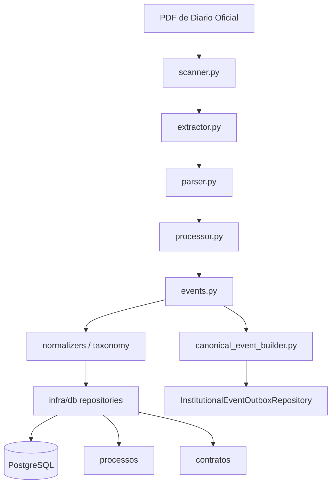
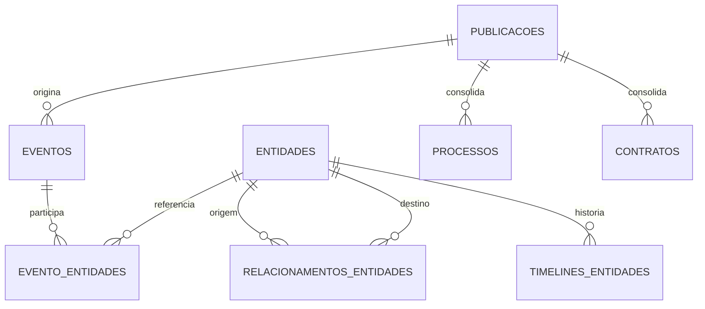
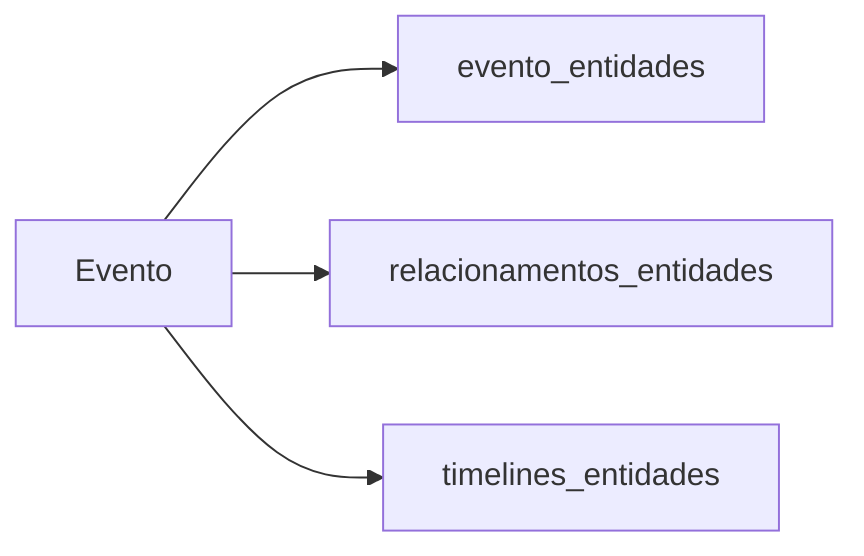
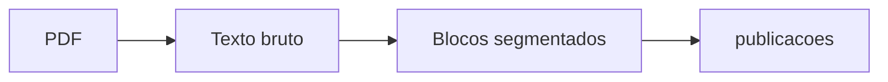
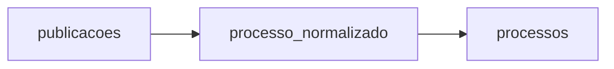
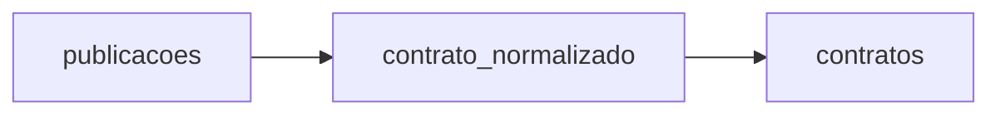
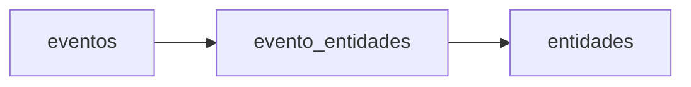
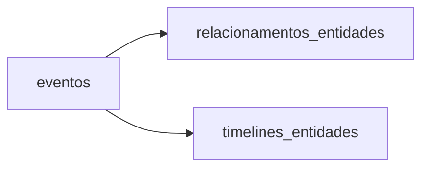

# DOCUMENTACAO TECNICA OFICIAL

## 1. Visao Geral

O `diario_processor` e um pipeline de inteligencia documental para Diarios Oficiais municipais. O objetivo atual e converter PDFs publicos em evidencia documental preservada, metadados estruturados, eventos institucionais, relacoes semanticas e catalogos consolidados de processos e contratos.

O problema que a aplicacao resolve e a transformacao de publicacoes oficiais, originalmente espalhadas em texto bruto e com baixa estrutura, em uma base consultavel e rastreavel. O sistema preserva o texto original de cada bloco e trabalha em cima dele para extrair informacoes por contexto documental.

Principios arquiteturais efetivamente adotados:

- Evidencia documental vem antes de interpretacao.
- Cada publicacao e tratada como bloco independente.
- O texto bruto do bloco nunca e descartado.
- Extracoes priorizam contexto documental, nao correspondencia ampla.
- Processos e contratos sao catalogos consolidados, nao atributos soltos.
- Pessoas, empresas e orgaos sao entidades nominativas.
- Relacionamentos e eventos guardam a origem documental.
- Consolidacao e idempotente e baseada em chaves normalizadas.
- A arquitetura aceita incrementalidade, mas o fluxo principal atual reprocessa tudo por configuracao fixa.

## 2. Arquitetura Geral

### Camadas ativas



### Leitura de estado

| Componente | Estado | Papel |
|---|---|---|
| `main.py` | Implementado e usado | Orquestra a ingestao, a persistencia e a consolidacao final |
| `scanner.py` | Implementado e usado | Localiza PDFs e extrai `diario_id` e `data_publicacao` |
| `extractor.py` | Implementado e usado | Extrai texto bruto do PDF |
| `parser.py` | Implementado e usado | Segmenta blocos e extrai campos contextuais |
| `processor.py` | Implementado e usado | Monta os metadados do bloco e decide enriquecimento |
| `events.py` | Implementado e usado | Constroi eventos institucionais a partir do bloco |
| `canonical_event_builder.py` | Implementado, uso parcial | Monta payload canonico para outbox analitica |
| `normalizer.py` | Implementado e usado | Normaliza processos, contratos, fornecedores e contratantes |
| `normalizers/entity_normalizer.py` | Implementado e usado | Canonicaliza nomes de entidades para o grafo |
| `infra/db/*` | Implementado e usado | Conexao, migracoes e repositorios Postgres |
| `consolidador_processos.py` / `consolidador_contratos.py` | Implementado e usado | Consolidam catalogos finais apos a ingestao |
| `database.py` | Implementado mas legado | Camada SQLite de compatibilidade local e testes |
| `analytics.py` / `analytics_cli.py` | Implementado mas auxiliar | Consultas analiticas sobre a base SQLite legado |
| `backfill.py` | Implementado mas auxiliar | Preenche campos derivados em registros antigos da base SQLite |
| `tools/*` | Implementado mas auxiliar | Gera corpus de regressao e fixtures esperados |

## 3. Estrutura do Projeto

| Caminho | Responsabilidade | Estado |
|---|---|---|
| `main.py` | Entrada principal do pipeline, leitura de PDFs, persistencia de eventos/publicacoes e consolidacao final | Implementado e usado |
| `scanner.py` | Varre o diretorio base, identifica arquivos e extrai a data do diario | Implementado e usado |
| `extractor.py` | Converte PDF em texto usando `pdfplumber` e corrige encoding com `ftfy` | Implementado e usado |
| `parser.py` | Segmenta publicacoes e extrai processo, contrato, CNPJ, fornecedor, contratante, vigencia, objeto e valores | Implementado e usado |
| `processor.py` | Aplica classificacao documental e decide quando enriquecer campos contratuais | Implementado e usado |
| `events.py` | Transforma blocos em eventos de contratacao, nomeacao, exoneracao e designacao de fiscal | Implementado e usado |
| `canonical_event_builder.py` | Gera payload canonico para integracao externa | Implementado, uso parcial |
| `normalizer.py` | Normaliza identidades textuais de negocio | Implementado e usado |
| `classifier.py` | Define quais tipos recebem enriquecimento contratual | Implementado e usado |
| `taxonomy/` | Centraliza constantes de entidades, eventos e relacoes | Implementado e usado |
| `normalizers/` | Normalizacao canonica de entidades nominativas | Implementado e usado |
| `infra/db/connection.py` | Pool de conexao Postgres com retry | Implementado e usado |
| `infra/db/migrations/` | Migra schema e registra versoes aplicadas | Implementado e usado |
| `infra/db/repositories/` | Persistencia de publicacoes, eventos, entidades, relacoes, timelines e outbox | Implementado e usado |
| `consolidacao/base.py` | Executor comum para consolidadores | Implementado e usado |
| `consolidador_processos.py` | Consolida catalogo de processos | Implementado e usado |
| `consolidador_contratos.py` | Consolida catalogo de contratos | Implementado e usado |
| `database.py` | Persistencia SQLite de compatibilidade e manutencao local | Legado |
| `analytics.py` | Consultas analiticas sobre SQLite | Legado / auxiliar |
| `analytics_cli.py` | CLI para consultas analiticas | Legado / auxiliar |
| `backfill.py` | CLI de preenchimento tardio de campos derivados | Parcialmente implementado / auxiliar |
| `docs/` | Especificacao do parser e matriz de cobertura | Documentacao de apoio |
| `tests/` | Suite de validacao e regressao | Implementado e usado |
| `tools/` | Geradores de fixtures para testes | Implementado e usado em manutencao |

## 4. Pipeline Completo

### Fluxo principal

1. `main.py` chama `listar_pdfs()` e carrega todos os PDFs sob `BASE_DIARIO_PATH`.
2. Para cada PDF, `extrair_diario_id()` deriva o identificador do arquivo.
3. `extrair_texto()` converte o PDF em texto bruto.
4. `extrair_data_publicacao()` tenta recuperar a data oficial do cabeçalho.
5. `segmentar_publicacoes()` divide o diario em blocos independentes.
6. `extrair_metadados_bloco()` extrai e normaliza campos por bloco.
7. `extrair_eventos_bloco()` converte cada bloco em zero ou mais eventos institucionais.
8. `EventoRepository.salvar_evento()` persiste o evento.
9. `EntityRepository.obter_ou_criar()` resolve entidades canônicas.
10. `EventoRepository.relacionar_entidade()` vincula eventos a entidades.
11. `EntityRelationshipRepository.criar_relacao()` cria relacoes derivadas entre entidades.
12. `TimelineRepository.abrir_vinculo()` e `fechar_vinculo()` atualizam a historia funcional.
13. `PublicacaoRepository.salvar_publicacao()` persiste o bloco cru e os metadados.
14. Ao fim do lote, `consolidar_postgres()` e `consolidar_contratos_postgres()` constroem os catalogos consolidados.

### Fluxo textual

```text
PDF
 -> texto bruto
 -> blocos/publicacoes
 -> metadados de bloco
 -> eventos
 -> entidades
 -> relacoes
 -> timelines
 -> publicacoes persistidas
 -> processos consolidados
 -> contratos consolidados
```

### Pontos de entrada

- `python main.py` ou execucao equivalente do modulo principal.
- `python run_migrations.py` para criar/atualizar schema.
- `python backfill.py` para preenchimento tardio da base SQLite legado.
- `python analytics_cli.py` para consultas analiticas legadas.

## 5. Modelo de Dados

### Tabelas geridas pelo codigo atual

| Tabela | Finalidade | Origem | Relacionamentos | Status |
|---|---|---|---|---|
| `publicacoes` | Armazena cada bloco de diario com texto bruto e metadados extraidos | `PublicacaoRepository` e `database.py` legado | Origina eventos, entidades derivadas e catalogos consolidados | Ativa |
| `eventos` | Registra eventos institucionais extraidos de blocos | `EventoRepository` | Liga-se a `evento_entidades`, `relacionamentos_entidades` e `timelines_entidades` | Ativa |
| `entidades` | Catalogo canonico de pessoas, empresas e orgaos | `EntityRepository` | Base para eventos, relacoes e timelines | Ativa |
| `evento_entidades` | Vínculo entre evento e entidade com papel contextual | `EventoRepository.relacionar_entidade()` | FK para `eventos` e `entidades` | Ativa |
| `relacionamentos_entidades` | Relacao derivada entre duas entidades | `EntityRelationshipRepository` | FK conceitual para `entidades` e referencia a `eventos` | Ativa |
| `timelines_entidades` | Historia temporal de vinculos funcionais | `TimelineRepository` | FK conceitual para `entidades` e eventos de inicio/fim | Ativa |
| `processos` | Catalogo consolidado por `processo_normalizado` | `consolidador_processos.py` | Deriva de `publicacoes` | Ativa |
| `contratos` | Catalogo consolidado por `contrato_normalizado` | `consolidador_contratos.py` | Deriva de `publicacoes` | Ativa |
| `schema_migrations` | Controle de versao das migracoes | `infra/db/migrations/runner.py` | Mantem trilha de migracao | Ativa |

### Campos centrais da `publicacoes`

- `diario_id`
- `numero_bloco`
- `arquivo_path`
- `texto_bloco`
- `tipo`
- `processo`
- `contrato`
- `contrato_normalizado`
- `contratante`
- `contratante_normalizado`
- `fornecedor`
- `fornecedor_normalizado`
- `cnpj`
- `valores`
- `valor_principal`
- `vigencia`
- `objeto`
- `data_processamento`
- `processo_normalizado`
- `data_publicacao`

### Campos centrais das demais tabelas

- `eventos`: `tipo_evento`, `agente_nome`, `cargo`, `orgao`, `entidade_origem`, `entidade_destino`, `processo`, `contrato`, `valor`, `diario_id`, `numero_bloco`, `evidencia_textual`, `data_publicacao`
- `entidades`: `tipo_entidade`, `nome_original`, `nome_normalizado`
- `evento_entidades`: `evento_id`, `entidade_id`, `papel`
- `relacionamentos_entidades`: `entidade_origem_id`, `entidade_destino_id`, `tipo_relacao`, `diario_id`, `data_publicacao`, `evento_id`
- `timelines_entidades`: `entidade_id`, `orgao_entidade_id`, `tipo_vinculo`, `data_inicio`, `data_fim`, `ativo`, `evento_inicio_id`, `evento_fim_id`
- `processos`: `processo`, `processo_normalizado`, `data_primeira_publicacao`, `data_ultima_publicacao`, `quantidade_publicacoes`
- `contratos`: `contrato`, `contrato_normalizado`, `data_primeira_publicacao`, `data_ultima_publicacao`, `quantidade_publicacoes`

### Tabelas presentes apenas no dump `diario_schema.sql`

Estas tabelas aparecem no dump do banco, mas nao sao referenciadas pelo codigo Python atual:

- `backupeventos_20260704`
- `classificacao_pendente`
- `eventos_institucionais`
- `ocorrencias_qualidade`
- `orgaos`
- `orgaos_aliases`
- `regras_qualidade`

Elas devem ser tratadas como artefatos legados do banco e nao como parte do fluxo principal descrito nesta documentacao.

### Diagrama relacional



## 6. Entidades de Dominio

### Publicacao

A publicacao e a menor unidade persistida do sistema. Ela representa um bloco documental segmentado do Diario Oficial e guarda o texto bruto como evidencia primaria.

- Identidade: `diario_id` + `numero_bloco` + `arquivo_path`
- Origem: segmentacao do PDF original
- Responsabilidade: preservar evidencia e metadados locais
- Ciclo de vida: nasce na ingestao, pode receber campos derivados, e permanece como registro historico

### Processo

Processo e uma entidade consolidada. Ele nao e apenas um campo de publicacao; e um catalogo proprio gerado a partir de `processo_normalizado`.

- Identidade: `processo_normalizado`
- Origem: derivado das publicacoes
- Responsabilidade: agrupar todas as ocorrencias do mesmo processo
- Ciclo de vida: consolidado apos a ingestao e atualizado por UPSERT

### Contrato

Contrato e outra entidade consolidada e segue a mesma logica do processo.

- Identidade: `contrato_normalizado`
- Origem: derivado das publicacoes
- Responsabilidade: agrupar publicacoes vinculadas ao mesmo instrumento
- Ciclo de vida: consolidado apos a ingestao e atualizado por UPSERT

### Evento

Evento e a abstracao institucional derivada da publicacao. Ele representa algo que ocorreu no dominio, como contratacao, nomeacao ou exoneracao.

- Identidade: `id` do banco + tipo do evento
- Origem: `events.py`
- Responsabilidade: tornar inferencia documental consultavel
- Ciclo de vida: criado por bloco e persistido com evidencia textual

### Pessoa

Pessoa e uma entidade nominativa. Ela representa o agente publico ou servidor identificado em eventos funcionais.

- Identidade: `tipo_entidade = PESSOA` + `nome_normalizado`
- Origem: `EntityRepository`
- Responsabilidade: consolidar nomes de pessoas em forma canonica
- Ciclo de vida: criada sob demanda e reutilizada em eventos e timelines

### Empresa

Empresa e a entidade nominativa usada para fornecedores e contratadas.

- Identidade: `tipo_entidade = EMPRESA` + `nome_normalizado`
- Origem: `EntityRepository`
- Responsabilidade: representar o polo privado nos eventos contratuais
- Ciclo de vida: criada sob demanda e reutilizada em eventos e relacoes

### Orgao

Orgao e a entidade nominativa publica.

- Identidade: `tipo_entidade = ORGAO_PUBLICO` + `nome_normalizado`
- Origem: `EntityRepository`
- Responsabilidade: representar secretaria, fundo ou orgao de lotacao/contratante
- Ciclo de vida: criada sob demanda e reutilizada em eventos, relacoes e timelines

## 7. Normalizacao

### Camada `normalizer.py`

Esta camada normaliza campos de negocio extraidos do bloco.

- `normalize_processo()`: preserva o formato textual canonico do processo, removendo espacos espurios e pontuacao final.
- `normalize_contrato()`: limpa separadores e pontuacao residual sem destruir a forma do instrumento.
- `normalize_fornecedor()` e `normalize_contratante()`: delegam para `normalize_entidade()`.
- `normalize_entidade()`: remove acentos, padroniza caixa alta, tokeniza e remove sufixos empresariais fortes e alguns finais.

### Camada `normalizers/entity_normalizer.py`

Esta camada normaliza entidades nominativas para deduplicacao no catalogo de `entidades`.

- Remove acentos.
- Converte para uppercase.
- Compacta `S A` em `SA`.
- Remove sufixos empresariais como `LTDA`, `EIRELI`, `SA`, `ME`, `EPP`.
- Mantem o nome original separado do nome normalizado.

### Campos normalizados no modelo

- `processo_normalizado`
- `contrato_normalizado`
- `fornecedor_normalizado`
- `contratante_normalizado`

### Utilizacao

- `processor.py` preenche os campos normalizados no momento da extracao.
- `backfill.py` pode recomputar campos ausentes em registros antigos da base SQLite.
- `EntityRepository` usa normalizacao de entidade para identificar registros canônicos.
- `consolidador_processos.py` e `consolidador_contratos.py` dependem dos campos normalizados como chave de agrupamento.

## 8. Consolidadores

### Infraestrutura

`consolidacao/base.py` fornece o executor generico baseado em callbacks. Ele separa tres responsabilidades:

- carregar grupos agregados
- persistir cada grupo
- executar uma preparacao opcional da base local

### Consolidador de processos

`consolidador_processos.py` agrupa `publicacoes` por `processo_normalizado`.

- Usa a menor representacao original nao vazia como forma textual do processo.
- Calcula a primeira e a ultima data de publicacao do grupo.
- Conta quantas publicacoes alimentam o catalogo consolidado.
- Usa `UPSERT` em Postgres para manter idempotencia.

### Consolidador de contratos

`consolidador_contratos.py` segue a mesma estrategia para `contrato_normalizado`.

- Agrupa por contrato normalizado.
- Mantem primeira e ultima data de publicacao.
- Atualiza quantidade de publicacoes.
- Usa `UPSERT` em Postgres.

### Idempotencia

Os consolidadores sao idempotentes por design porque:

- o agrupamento parte da chave normalizada
- o Postgres recebe `ON CONFLICT`
- as versoes SQLite usadas em testes atualizam apenas quando houve mudanca de estado

### Critereos de agregacao

- `MIN(NULLIF(BTRIM(...), ''))` para a forma textual original mais enxuta
- `MIN(data_publicacao)` para a primeira publicacao
- `MAX(data_publicacao)` para a ultima publicacao
- `COUNT(*)` para a quantidade total

## 9. Camada Institucional

### Eventos

`events.py` produz eventos a partir do bloco e da classificacao documental.

Eventos atualmente emitidos pelo fluxo principal:

- `CONTRATACAO`
- `DESIGNACAO_FISCAL`
- `NOMEACAO`
- `EXONERACAO`

### Entidades

As entidades sao resolvidas por tipo e nome normalizado.

- `PESSOA`
- `EMPRESA`
- `ORGAO_PUBLICO`

### Relacionamentos

`taxonomy.relation_resolver.resolver_relacao_evento()` mapeia o tipo de evento para um tipo de relacionamento semantico.

- `NOMEACAO` -> `nomeado_em`
- `EXONERACAO` -> `exonerado_de`
- `CONTRATACAO` -> `contratou`
- `DESIGNACAO` -> `designado_para`
- `DISPENSA` -> `autorizou`
- `LICITACAO` -> `participou_licitacao`
- fallback -> `related_to`

### Timeline

`TimelineRepository` materializa vinculos funcionais entre pessoa e orgao.

- `abrir_vinculo()` e acionado em nomeacao.
- `fechar_vinculo()` e acionado em exoneracao.
- O tipo de vinculo gravado hoje e `LOTACAO`.
- A timeline e restrita ao dominio funcional e nao substitui o grafo de relacoes.

### Outbox canonico

`canonical_event_builder.py` cria um payload canonico com `schema_version`, `source` e `event`.

Estado atual:

- A construcao do payload existe.
- A publicacao para outbox e condicional.
- O repositorio de outbox so publica se a tabela externa existir.

Limite atual importante:

- `InstitutionalEventOutboxRepository.publish()` espera `event.to_dict()`.
- `build_institutional_event()` retorna `dict`.
- Se a outbox externa estiver habilitada, essa interface precisa estar consistente no runtime externo ou a publicacao falhara.

## 10. Camada de Relacionamentos

### O que existe

- `evento_entidades` representa participacao de entidades em um evento.
- `relacionamentos_entidades` representa um relacionamento persistente derivado do evento.
- `timelines_entidades` representa um relacionamento temporal entre pessoa e orgao.

### Responsabilidades

- `evento_entidades` registra contexto imediato.
- `relacionamentos_entidades` registra conhecimento derivado.
- `timelines_entidades` registra permanencia e encerramento de vinculo.

### Limitacoes atuais

- Nao existe motor de grafo nativo.
- Nao existe consolidacao de relacoes duplicadas.
- Nao existe travessia multi-hop implementada no codigo atual.
- O sistema nao unifica automaticamente relacoes semanticamente equivalentes produzidas em blocos diferentes.
- A timeline cobre apenas o eixo funcional pessoa-orgao.

### Fluxo de relacionamento



## 11. Principios Arquiteturais

### Evidencia documental

O texto bruto do bloco e preservado em `publicacoes.texto_bloco` e tambem referenciado por eventos via `evidencia_textual`.

### Identidade canonica

Campos normalizados sustentam a identidade de processos, contratos e entidades nominativas.

### Entidades enxutas

Pessoa, empresa e orgao sao entidades simples, sem carga excessiva de atributos.

### Consolidacao

Processos e contratos sao catalogos consolidados e nao simples campos auxiliares.

### Rastreabilidade

Cada evento e cada relacao mantem referencia ao `diario_id`, ao bloco e ao texto de origem.

### Incrementalismo

Existe a operacao `ja_processado()`, mas o `main.py` atual desativa a economia incremental por usar `REPROCESSAR_TUDO = True`.

### Separacao entre nominativo e administrativo

Pessoas, empresas e orgaos permanecem como entidades, enquanto processos e contratos sao objetos administrativos consolidados.

## 12. Fluxos de Dados

### PDF -> Publicacao



### Publicacao -> Processo



### Publicacao -> Contrato



### Evento -> Entidade



### Evento -> Relacionamento



## 13. Estrategia de Testes

### Testes unitarios

- `tests/test_parser.py` cobre extracao de processo, contrato, vigencia, objeto, CNPJ, valores e segmentacao.
- `tests/test_events.py` cobre geracao de eventos, subeventos e associacao de metadados.
- `tests/test_processor.py` cobre enriquecimento contratual seletivo.
- `tests/test_normalizer.py` valida regras de normalizacao.

### Regressoes

- `tests/test_regression.py` protege casos reais de segmentacao.
- `tests/test_corpus.py` e o corpus versionado de exemplos extraidos de diarios reais.

### Auditorias SQL

- `tests/test_postgres_infra.py` valida SQL gerado por migracoes, repositorios e consolidadores.
- A estrategia usa conexoes falsas para inspecionar comandos sem depender de banco real.

### Validacoes arquiteturais

- `tests/test_database.py` confirma preservacao de texto bruto e indices analiticos no legado SQLite.
- `tests/test_backfill.py` verifica preenchimento tardio sem sobrescrever dados validos.
- `tests/test_analytics.py` garante que as consultas nao alteram a evidencia original.

## 14. Historico Arquitetural

Evolucoes efetivamente incorporadas ao projeto:

- Fortalecimento do parser documental.
- Normalizacao de processo e contrato.
- Criacao dos catalogos consolidados de Processo e Contrato.
- Criacao da entidade Processo.
- Criacao da infraestrutura de consolidacao.
- Propagacao de `data_publicacao`.
- Estruturacao da camada de eventos institucionais.
- Estruturacao da camada de relacoes entre entidades.
- Introducao de timelines para vinculos funcionais.
- Separacao entre base legada SQLite e base atual em PostgreSQL.

## 15. Decisoes Arquiteturais Consolidadas

- Publicacoes representam evidencias documentais.
- O Diario Oficial nao e tratado como um unico documento logico.
- Processo permanece em catalogo proprio.
- Contrato permanece em catalogo proprio.
- Entidades representam atores nominativos.
- Consolidadores constroem catalogos a partir das evidencias.
- Relacoes representam conhecimento derivado.
- A persistencia oficial atual e PostgreSQL.
- SQLite ficou como compatibilidade local, testes e utilitarios auxiliares.

## 16. Inventario e Validacao

### Arquivos analisados

- `main.py`
- `scanner.py`
- `extractor.py`
- `parser.py`
- `processor.py`
- `events.py`
- `canonical_event_builder.py`
- `normalizer.py`
- `classifier.py`
- `config.py`
- `database.py`
- `analytics.py`
- `analytics_cli.py`
- `backfill.py`
- `consolidador_processos.py`
- `consolidador_contratos.py`
- `consolidacao/base.py`
- `infra/db/connection.py`
- `infra/db/migrations/runner.py`
- `infra/db/migrations/*.sql`
- `infra/db/repositories/*.py`
- `taxonomy/*.py`
- `normalizers/entity_normalizer.py`
- `tools/gerar_expected.py`
- `tests/*.py`
- `diario_schema.sql`
- `README.md`
- `documentacao_tecnica.md`

### Arquivos documentados

- `documentacao_tecnica.md`

### Modulos documentados

- Ingestao de PDFs
- Segmentacao e parser documental
- Extracao de metadados
- Eventos institucionais
- Normalizacao
- Persistencia PostgreSQL
- Consolidacao de processos e contratos
- Camada relacional e temporal
- Testes e utilitarios de manutencao

### Quantidade aproximada de paginas

- Aproximadamente 14 a 16 paginas em renderizacao Markdown comum, dependendo da largura do editor e da largura das tabelas.

### Principais diagramas produzidos

- Diagrama geral da arquitetura
- Diagrama ER do modelo de dados
- Fluxos `PDF -> Publicacao`, `Publicacao -> Processo`, `Publicacao -> Contrato`, `Evento -> Entidade`, `Evento -> Relacionamento`
- Diagrama da camada de relacionamentos

### Inconsistencias encontradas

- `main.py` mantem `REPROCESSAR_TUDO = True`, entao a incrementalidade existe, mas nao fica ativa no fluxo padrao.
- `InstitutionalEventOutboxRepository.publish()` espera `to_dict()`, enquanto `build_institutional_event()` retorna `dict`.
- `taxonomy/event_taxonomy.py` define mais tipos de evento do que `events.py` emite hoje.
- O dump `diario_schema.sql` contem tabelas sem referencia no codigo atual, o que indica legado de banco nao refletido no fluxo Python principal.

